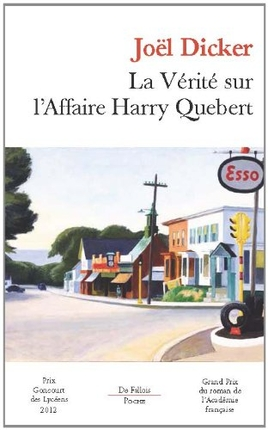

# Reading

## My outlook

I discovered photography when I was very young and when my father introduce to me essentials. After that, I took many years to save money and to buy my first camera - 650D Canon - which I still use. I have a 18-55 lens and a Canon EF 70-300mm f/4-5.6 IS USM Lens.

I think that the relationship with photography is very private, we only take pictures of things that reach us deeply. Everybody has his *own vision* of a beautiful pic, everybody has a “look” and from the same scene, we all saw (at least photographers) a way to take a picture that we may like. Clearly, there are some rules to follow, some techniques that can be helpful to capture the feeling and details of a sight.

### What I love in photography is quite simple:

First, **immortality**. We froze a scene for eternity when we shoot. It’s a manner to ensure evanescent things. I like when I fall randomly on old pics which remember me past times. Photography helps us to not forget some things.

Secondly, **infinity**. It’s always possible to progress, discover new approach in photography. This art is in constant evolution. All is possible, we can play with every colors.
Finally, sharing. Photography allows people to meet each other, sharing experiences, techniques and advices. A professional can appreciate pics made by a beginner, he may find idea for his own pics.

My pictures are often about nature: ocean, birds, trees, landscapes. Too many things that we have to safeguard. Most of my shots were made around places where I lived. My point of view is that it’s cool to travel, see many things and meet many people, but we must not forget that there is a singular beauty around us; everywhere, and I seize it with my camera.

## Few techniques

### Long-exposure photography

### Movement photography

### Lightning bolt photography

### Stars photography

### Macrophotography

### Nature

<figure>
	
</figure>

## “To photograph truthfully and effectively is to see beneath the surfaces.” – Ansel Adams