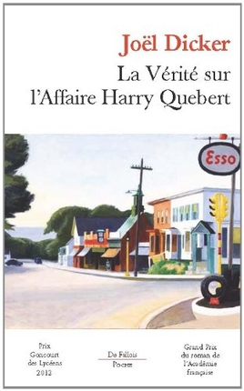

# Reading

## My outlook

I always have a book on me; in my laptop case, in my pouch or on my bedside table. I really like read because we create our own space, representations and we make the thought effort to build the scene virtually. By reading, we spend time on another way, without a colorful screen ahead us, it's a really peaceful activity, quiet and at the same time very consuming.

## Favourite books

I have not favourite genre of book. When a book comes at hand, I read it. I had read adventure, fantasy, historical, crime, war and science books. Here I give you few suggestions of books that completely made me mental by their beauty or relative strength.

* Joël Dickers - La vérité sur l'affaire Harry Quebert

<figure>
	
</figure>

* Joel Dickers - La vérité sur l'affaire Harry Quebert

* Joel Dickers - La vérité sur l'affaire Harry Quebert

* Joel Dickers - La vérité sur l'affaire Harry Quebert